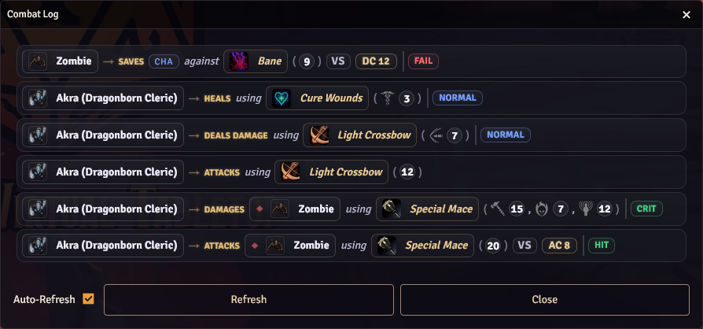

# FurtherV's Combat Log

## Description

This module provides with nicely styled and easily readable combat log, giving you direct knowledge of WHO rolled WHAT against WHO with WHAT.
It shows attack rolls, damage rolls, saving throws and manual rolls, including targets and AC / DC where possible.

**Do note that the combat log is currently quite wide, at least 900px. A future version will include a variant that can be less wide.**

## How To Use

Currently there is not button to open the CombatLog application, but you can paste the following code into your console or a script macro in order to open it: `ui.combatlog.render({force: true})`.

## Roadmap

- Implement a button to open Combat Log
- Allow target selection and damage application from Combat Log
- Allow font size adjustments of the Combat Log
- Allow user CSS overwrite
- Use i18n instead of hard coded strings